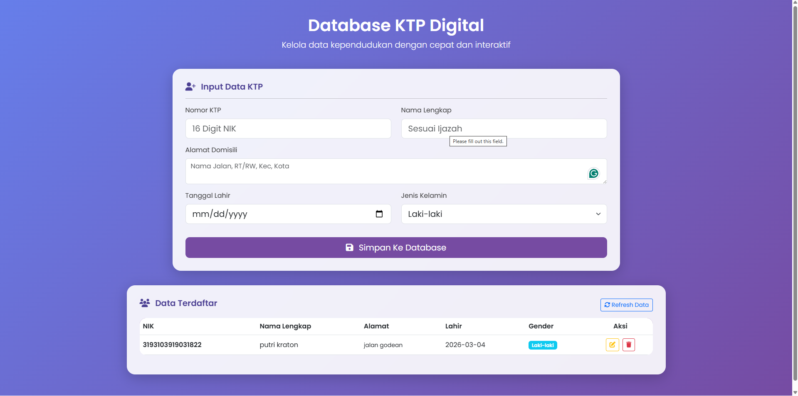
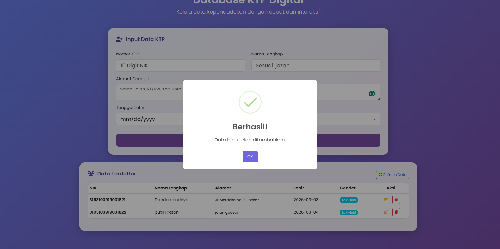
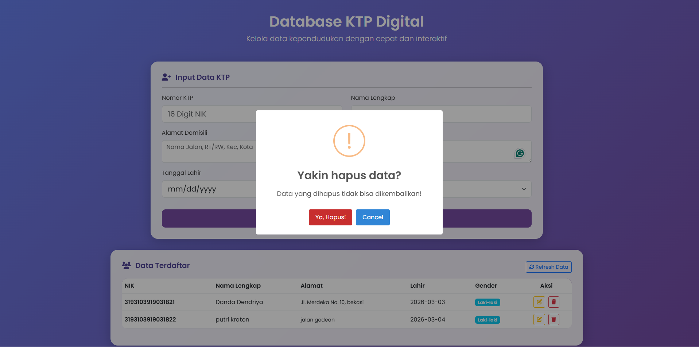
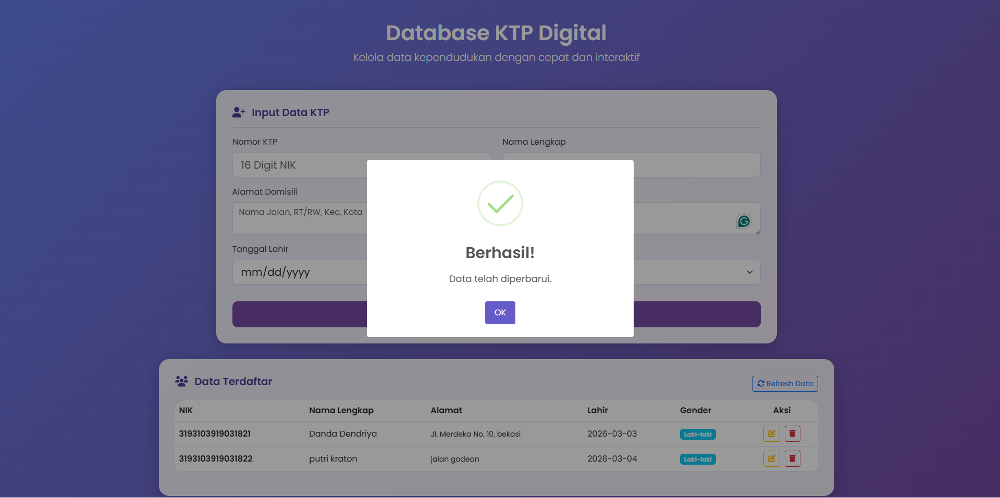
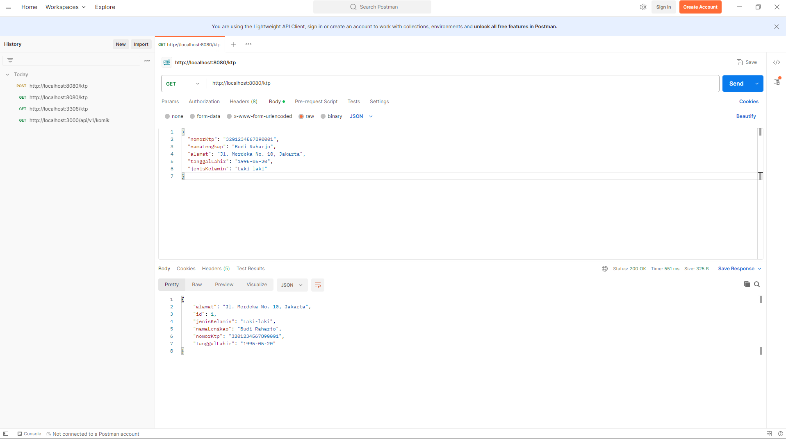
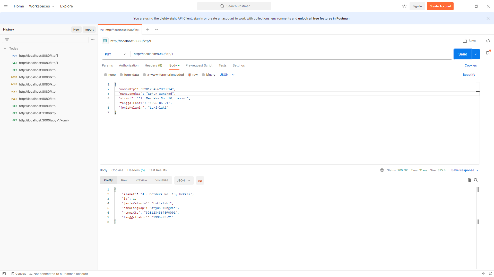
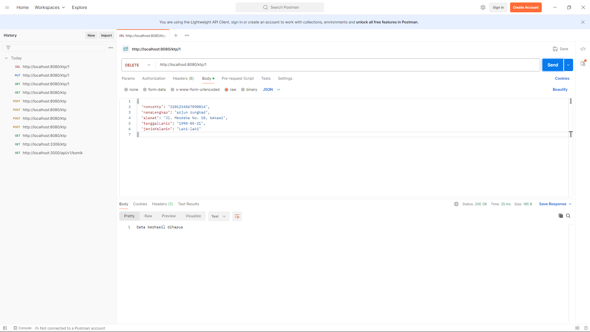

1. tampilan website kelola ktp

2. fitur notifikasi berhasil menambahkan data

3. fitur notifikasi persetujuan hapus data

4. fitur notifikasi update data

5. testing get dipostman

6. testing post dipostman

7. testing put dipostman

8. testing delete dipostman
